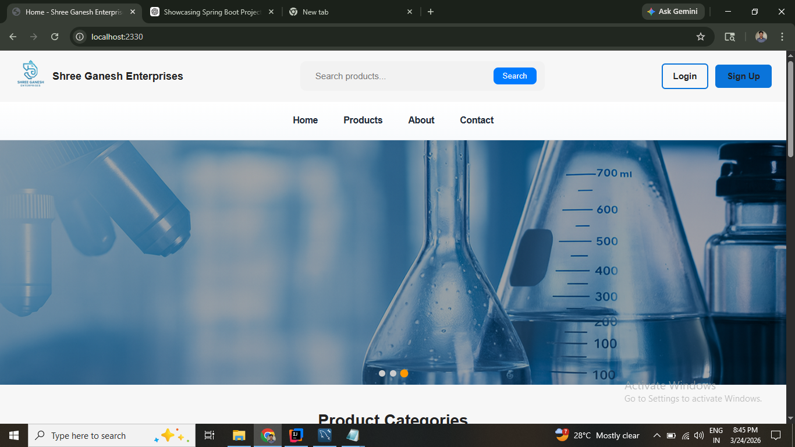
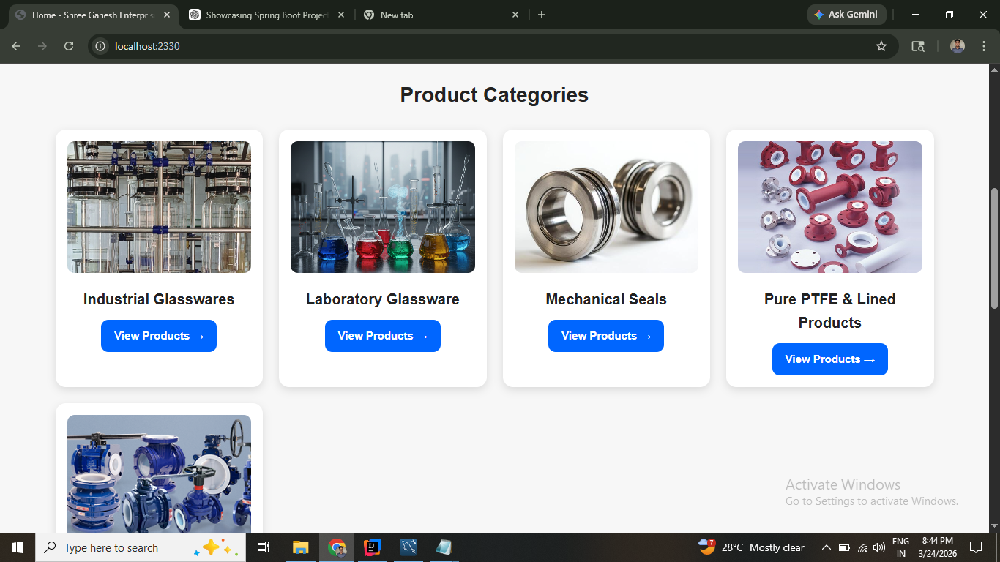
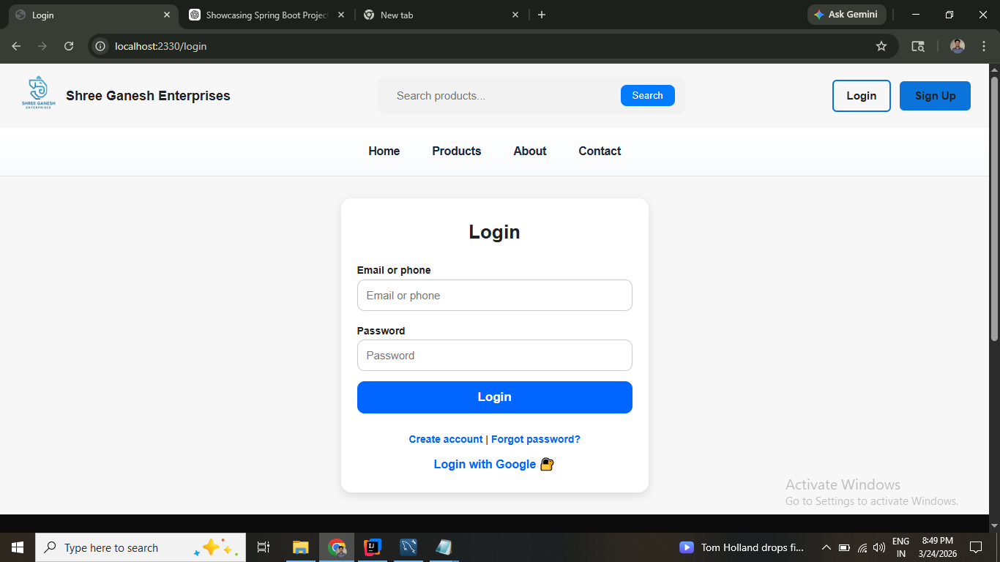
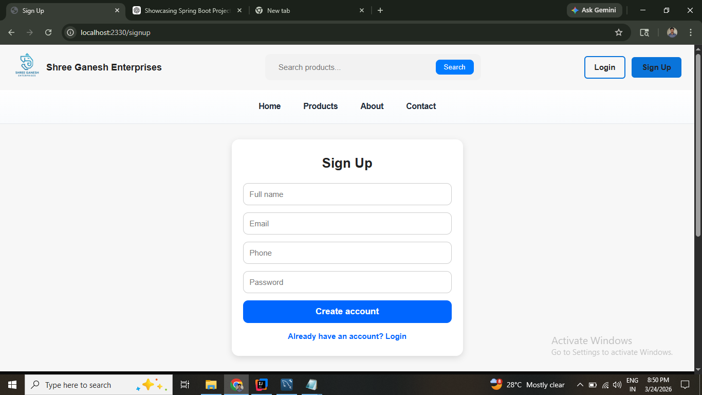
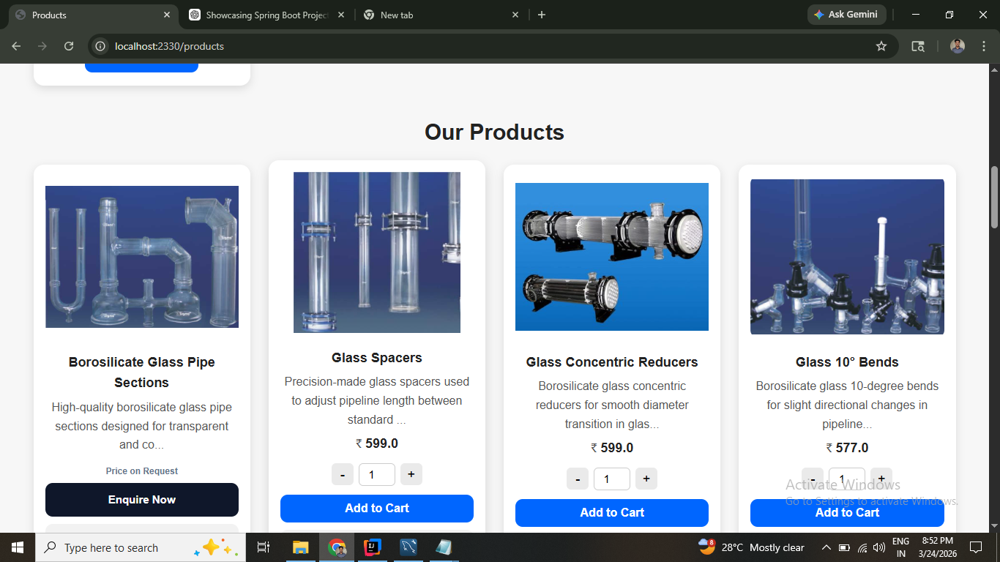
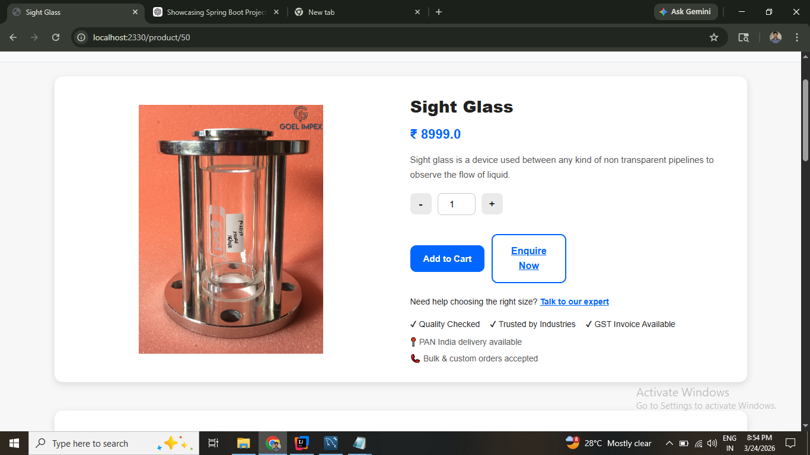
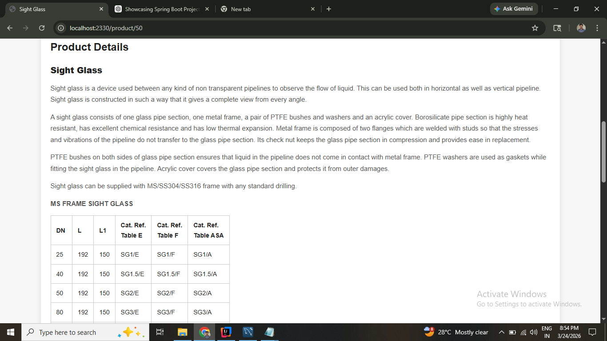
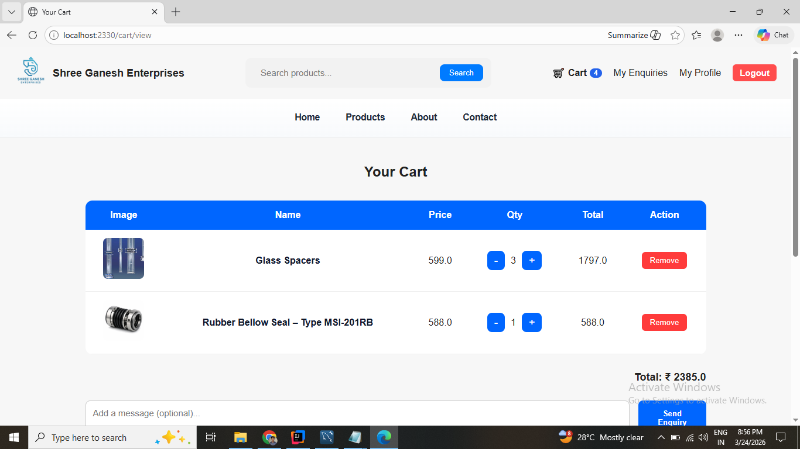
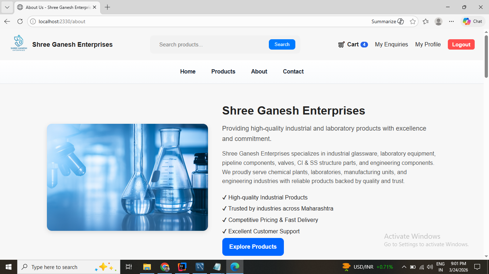
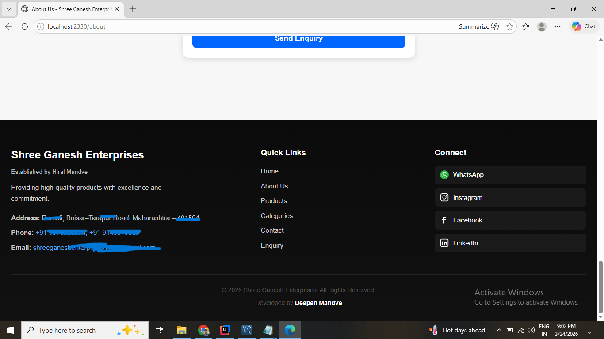

# 🏪 Shree Ganesh Enterprises

A full-stack web application built using **Spring Boot** to manage store operations with secure authentication, database integration, and email-based services.

---

## 🚀 Overview

* 🔐 Secure authentication using **Spring Security**
* 🔑 OAuth2 login (Google / third-party login support)
* 📲 Two-Factor Authentication (2FA) using **TOTP**
* 📧 Email integration for OTP and notifications
* 🗄️ Database management using **Spring Data JPA & MySQL**
* 🌐 Dynamic UI with **Thymeleaf**
* ✅ Form validation using **Jakarta Validation**
* 📊 Application monitoring with **Spring Boot Actuator**

---

## 🛠️ Tech Stack

### 🔹 Backend

* Java 21
* Spring Boot 3
* Spring MVC
* Spring Data JPA (Hibernate)

### 🔹 Frontend

* Thymeleaf
* HTML5
* CSS3

### 🔹 Security

* Spring Security
* OAuth2 Client
* TOTP (Time-based OTP)

### 🔹 Database

* MySQL

### 🔹 Other Tools

* Lombok
* Spring Boot DevTools
* Maven

---

## 📂 Project Structure

* Controller Layer – Handles HTTP requests
* Service Layer – Business logic
* Repository Layer – Database operations
* Entity Layer – Database models

---

## ✨ Features

* REST APIs
* CRUD operations
* Authentication (Google OAuth)
* Email integration

---

## ⚙️ Setup Instructions

1. Clone the repository
2. Set environment variables:

   ```
   DB_URL=your_database_url
   DB_USERNAME=your_username
   DB_PASSWORD=your_password
   ```
3. Run the application:

   ```
   mvn spring-boot:run
   ```

---

## 📸 Screenshots

### 🏠 Home Page



### 🛍️ Product Categories



### 🔐 Login Page



### 📝 Sign Up



### 🛒 Our Products





### 🧺 Cart View



### ℹ️ About Page



### 📌 Footer



---

## 👨‍💻 Author

**Deepen Mandve**

---

## ⭐ Support

If you like this project, give it a ⭐ on GitHub!
